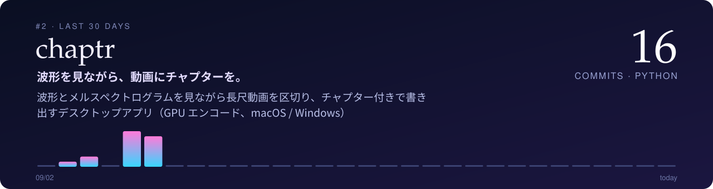

  

  <b>手元の作業を、手元で完結させる道具をつくっています。</b> 
  演奏会の録画、紙のアンケート、スキャンした本、計測データ — 目の前の素材を、そのまま使える形へ。

  
  
  
  
  
  

## ✦ Featured — 代表作

<!-- FEATURED:START -->
<table>
<tr>
<td width="58%" valign="middle"></td>
<td width="42%" valign="middle">
01 · 🎬 Video &amp; Audio
<h3><a href="https://github.com/mashi727/media-scribe-workflow">media-scribe-workflow</a></h3>

<b>録画を、引き直せる知識に。</b>

動画・音声から字幕・チャプター・記録 PDF を作る CLI 群。できた記録をトピックごとに束ね直すと、動画をまたいだ索引になる（例：レッスン動画 31 本 → 奏法の課題 84 件）。

<a href="https://github.com/mashi727/media-scribe-workflow">→ mashi727/media-scribe-workflow を開く</a>

</td>
</tr>
<tr>
<td width="42%" valign="middle">
02 · 🎬 Video &amp; Audio
<h3><a href="https://github.com/mashi727/chaptr">chaptr</a></h3>

<b>波形を見ながら、動画にチャプターを。</b>

演奏会・レッスン・講義の長尺録画を、2 段の波形とメルスペクトログラムを見ながら章立てするデスクトップアプリ。人が決めるべき境界の判断だけを GUI に残し、書き出しは media-scribe-workflow の CLI に任せている。

<a href="https://github.com/mashi727/chaptr">→ mashi727/chaptr を開く</a>

</td>
<td width="58%" valign="middle"></td>
</tr>
<tr>
<td width="58%" valign="middle"></td>
<td width="42%" valign="middle">
03 · 📈 Measurement &amp; Science
<h3><a href="https://github.com/mashi727/iq-analyzer">iq-analyzer</a></h3>

<b>100 GB 級の IQ 計測データを、普通の PC で。</b>

Rohde &amp; Schwarz・Keysight の IQ 録音を、メモリに載せずに閲覧する。振幅エンベロープのキャッシュで 121 GB の WVD を 1.6 秒で開き、スペクトログラムはメモリ一定で計算する。

<a href="https://github.com/mashi727/iq-analyzer">→ mashi727/iq-analyzer を開く</a>

</td>
</tr>
</table>
<!-- FEATURED:END -->

## ⚡ Now — この1か月、いちばん手を動かしているもの

直近 30 日のコミット数順。見出しをクリックすると開閉します。

<!-- NOW:START -->

🥇 <a href="https://github.com/mashi727/book-viewer"><b>book-viewer</b></a> — 🔥 19 commits / 30日 · Python

 

<a href="https://github.com/mashi727/book-viewer"><b>→ mashi727/book-viewer を開く</b></a>

🥈 <a href="https://github.com/mashi727/chaptr"><b>chaptr</b></a> — 🔥 17 commits / 30日 · Python

 

<a href="https://github.com/mashi727/chaptr"><b>→ mashi727/chaptr を開く</b></a>

🥉 <a href="https://github.com/mashi727/media-scribe-workflow"><b>media-scribe-workflow</b></a> — 🔥 7 commits / 30日 · Python

 

<a href="https://github.com/mashi727/media-scribe-workflow"><b>→ mashi727/media-scribe-workflow を開く</b></a>

<!-- NOW:END -->

## 🗂 All projects

分野も各行も、最近更新したものが上に来ます（GitHub Actions で毎日自動更新）。

<!-- INDEX:START -->
#### 🧰 CLI & Utilities

| Project | | Updated |
| --- | --- | --- |
| [**claude‑imedict**](https://github.com/mashi727/claude-imedict) | Claude Code の対話履歴から自分の語彙を抽出し、macOS 標準と azooKey のユーザー辞書を生成する（読みは macOS 内蔵のトークナイザで推定） | 2026‑10 |
| [**deepl‑cli**](https://github.com/mashi727/deepl-cli) | DeepL API のコマンドラインクライアント。標準入出力・クリップボードに対応 | 2025‑10 |
| [**qrgene**](https://github.com/mashi727/qrgene) | Excel の一覧から QR コードを生成し PDF に割り付け（Go） | 2022‑09 |

#### 🎬 Video & Audio

| Project | | Updated |
| --- | --- | --- |
| [**media‑scribe‑workflow**](https://github.com/mashi727/media-scribe-workflow) | 動画・音声から字幕・チャプター・LuaTeX レポート PDF を生成する CLI 群とパイプライン（Whisper / Deepgram） | 2026‑10 |
| [**chaptr**](https://github.com/mashi727/chaptr) | 演奏会・レッスン・講義の長尺録画を、2 段の波形とメルスペクトログラムを見ながら章立てするデスクトップアプリ（macOS / Windows）。書き出しは media-scribe-workflow の CLI が担う | 2026‑10 |
| [**fb‑video‑downloader**](https://github.com/mashi727/fb-video-downloader) | Facebook 動画の取得と、内容に即したファイル名の自動付与 | 2026‑09 |
| [**youtube‑cover‑cropper**](https://github.com/mashi727/youtube-cover-cropper) | YouTube サムネイル用に 16:9・1280×720 で切り出し | 2025‑12 |

#### 📈 Measurement & Science

| Project | | Updated |
| --- | --- | --- |
| [**iPhone‑G‑Sensor**](https://github.com/mashi727/iPhone-G-Sensor) | iPhone のモーションセンサー記録と、地理院地図上での推測航法による可視化 | 2026‑10 |
| [**iq‑analyzer**](https://github.com/mashi727/iq-analyzer) | Rohde & Schwarz の IQ 計測データ（IQW / WVH / WVD / iq.tar）を扱う高速ビューア | 2026‑09 |
| [**route‑planner**](https://github.com/mashi727/route-planner) | 標高プロファイルを解析するサイクリング用ルートプランナー | 2026‑07 |
| [**mandelbrot‑viewer**](https://github.com/mashi727/mandelbrot-viewer) | 3 枚の連動プロットで段階的に拡大するマンデルブロ集合ビューア（Numba） | 2026‑05 |

#### 📄 Documents & PDF

| Project | | Updated |
| --- | --- | --- |
| [**enquete**](https://github.com/mashi727/enquete) | 紙のアンケート（スキャン PDF）のチェック判定・自由記述 OCR・校正を、結果を PDF 自体に埋め込んで一気通貫で | 2026‑09 |
| [**book‑viewer**](https://github.com/mashi727/book-viewer) | 自炊本 PDF リーダー。見開き・右綴じを PDF 自体に記録し、読書位置を保持 | 2026‑09 |
| [**score‑viewer**](https://github.com/mashi727/score-viewer) | 楽譜 PDF ビューア。ファイル名から曲名を抽出してコピー | 2026‑09 |
| [**perspective‑corrector**](https://github.com/mashi727/perspective-corrector) | スライドを撮影した写真の台形歪みを補正 | 2026‑07 |
| [**vision‑book‑digitizer**](https://github.com/mashi727/vision-book-digitizer) | スキャン書籍 PDF → Markdown + 図版。縦書き対応、Apple Vision でオフライン処理 | 2026‑07 |
| [**macos‑vision‑ocr**](https://github.com/mashi727/macos-vision-ocr) | Apple Vision による PDF OCR の CLI（オフライン・多言語） | 2026‑05 |
| [**luatex‑docker‑remote**](https://github.com/mashi727/luatex-docker-remote) | リモートの Docker で LuaTeX をコンパイル。`.sty` の自動同期と日本語組版に対応 | 2025‑11 |
| [**markdown‑uploader**](https://github.com/mashi727/markdown-uploader) | Markdown（数式・画像・コールアウト）を Notion へアップロード | 2025‑08 |
<!-- INDEX:END -->

---

<b>Contribution graph</b>

 

<picture>
  <source media="(prefers-color-scheme: dark)" srcset="https://raw.githubusercontent.com/mashi727/mashi727/output/github-contribution-grid-snake-dark.svg">
  
</picture>

