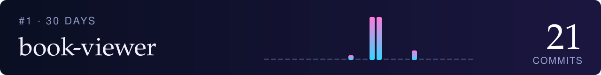
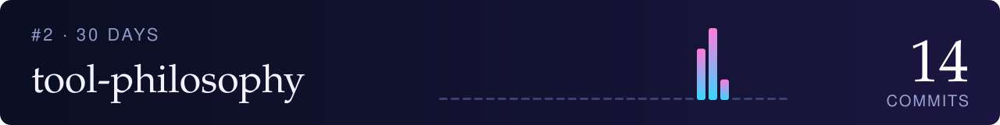

  

  <b>手元の作業を、手元で完結させる道具をつくっています。</b> 
  演奏会の録画、紙のアンケート、スキャンした本、計測データ — 目の前の素材を、そのまま使える形へ。

  
  
  
  
  
  

## 👤 About

計測・信号処理とメディア処理のパイプラインを、自分で使う道具として作っています。実験物理の出身です。

**進め方** — システムズエンジニアリングの枠組みで、上流を自分で担い、実装を AI に委任しています。

- **要求定義**：ドメインの知識から、創出すべき価値と課題を定める
- **機能割付**：人が判断すべきこと（UI）と、機械に任せることを分ける
- **V&V**：Verification（仕様どおりに作られているか：lint・テスト・件数の突き合わせ）と、Validation（実物で目的を果たすか：実際の録画・計測データでの確認）で受け入れる

各リポジトリの「考え方」の PAD（問題分析図）が、その要求と機能割付です。

**得意なこと**

- 大容量の計測データを普通の PC で扱う — [iq-analyzer](https://github.com/mashi727/iq-analyzer)（100 GB 級の IQ データをメモリに載せずに閲覧）
- 録音・録画の処理パイプライン — [media-scribe-workflow](https://github.com/mashi727/media-scribe-workflow)（複数 ASR の突き合わせ、TC・相互相関による音声同期）
- 人が判断する所だけを GUI に残すデスクトップアプリ — [Chaptr](https://github.com/mashi727/chaptr) / [enquete](https://github.com/mashi727/enquete) / [book-viewer](https://github.com/mashi727/book-viewer)
- 手順や計画の構造を検査できる形にする道具 — [padkit](https://github.com/mashi727/padkit)

技術：Python（PySide6・NumPy・ffmpeg）· Swift（Vision）· Go · PHP / MySQL · LuaLaTeX · GitHub Actions（CI・リリースビルド）

## 🧭 Philosophy — [道具は How である](https://github.com/mashi727/tool-philosophy)

道具の中身は問いません。どういう仕組みで動いているのか、誰が作ったのかは、あまり問題にしません。その代わり、四つのことだけは厳しく問います。

1. 目的にかなう働きをするか
2. 何度やっても同じ結果が出るか（再現性）
3. ほかの道具とうまくつながるか（相互運用性と再利用性）
4. 何をしたかの跡が残り、失敗したときに正直に言うか（来歴と、失敗の仕方）

あとの三つは機械に調べさせることができます（Verification）。最初の一つだけは、そうはいきません（Validation）。目的は道具の中にはないからです。

<a href="https://github.com/mashi727/tool-philosophy">→ 実際にやってきたことの記録を読む</a>

## ✦ Featured — 代表作

<!-- FEATURED:START -->
01 · 🧭 Ideas &amp; Workflow

### [padkit](https://github.com/mashi727/padkit)

**手順を図にすると、構造が見える。**

LLM が書いた手順や計画を PAD（問題分析図）に描くツールチェーン。散文では頭の中で組み立て直すしかない入れ子・反復・分岐の構造が、そのまま2次元の図として見える。描画エンジンが終了コード 0 のまま図を崩す入力は、独自パーサとの AST 突き合わせで止める。Claude Skill も同梱。

<a href="https://github.com/mashi727/padkit">→ mashi727/padkit を開く</a>

 

02 · 🎬 Video &amp; Audio

### [media-scribe-workflow](https://github.com/mashi727/media-scribe-workflow)

**録画を、引き直せる知識に。**

動画・音声から字幕・チャプター・記録 PDF を作る CLI 群。できた記録をトピックごとに束ね直すと、動画をまたいだ索引になる（例：レッスン動画 31 本 → 奏法の課題 84 件）。

<a href="https://github.com/mashi727/media-scribe-workflow">→ mashi727/media-scribe-workflow を開く</a>

 

03 · 🎬 Video &amp; Audio

### [chaptr](https://github.com/mashi727/chaptr)

**波形を見ながら、動画にチャプターを。**

演奏会・レッスン・講義の長尺録画を、2 段の波形とメルスペクトログラムを見ながら章立てするデスクトップアプリ。人が決めるべき境界の判断だけを GUI に残し、書き出しは media-scribe-workflow の CLI に任せている。

<a href="https://github.com/mashi727/chaptr">→ mashi727/chaptr を開く</a>

 

04 · 📈 Measurement &amp; Science

### [iq-analyzer](https://github.com/mashi727/iq-analyzer)

**100 GB 級の IQ 計測データを、普通の PC で。**

Rohde &amp; Schwarz・Keysight の IQ 録音を、メモリに載せずに閲覧する。振幅エンベロープのキャッシュで 121 GB の WVD を 1.6 秒で開き、スペクトログラムはメモリ一定で計算する。

<a href="https://github.com/mashi727/iq-analyzer">→ mashi727/iq-analyzer を開く</a>
<!-- FEATURED:END -->

## ⚡ Now — この1か月、いちばん手を動かしているもの

直近 30 日のコミット数順。見出しをクリックすると開閉します。

<!-- NOW:START -->

🥇 <a href="https://github.com/mashi727/book-viewer"><b>book-viewer</b></a> — 🔥 21 commits / 30日 · Python

 

自炊本 PDF リーダー。見開き・右綴じを PDF 自体に記録し、読書位置を保持

<a href="https://github.com/mashi727/book-viewer"><b>→ mashi727/book-viewer を開く</b></a>

🥈 <a href="https://github.com/mashi727/tool-philosophy"><b>tool-philosophy</b></a> — 🔥 14 commits / 30日 · Shell

 

道具は How である ── 中身は問わず、目的・再現性・つながり・正直な失敗の四つを問う。実際にやってきたことの記録

<a href="https://github.com/mashi727/tool-philosophy"><b>→ mashi727/tool-philosophy を開く</b></a>

🥉 <a href="https://github.com/mashi727/iq-analyzer"><b>iq-analyzer</b></a> — 🔥 7 commits / 30日 · Python

 

Rohde &amp; Schwarz の IQ 計測データ（IQW / WVH / WVD / iq.tar）を扱う高速ビューア

<a href="https://github.com/mashi727/iq-analyzer"><b>→ mashi727/iq-analyzer を開く</b></a>

<!-- NOW:END -->

## 🗂 All projects

分野も各行も、最近更新したものが上に来ます（GitHub Actions で毎日自動更新）。

<!-- INDEX:START -->
#### 📈 Measurement & Science

- [**iq-analyzer**](https://github.com/mashi727/iq-analyzer) — Rohde & Schwarz の IQ 計測データ（IQW / WVH / WVD / iq.tar）を扱う高速ビューア 2026‑10
- [**route-planner**](https://github.com/mashi727/route-planner) — 標高プロファイルを解析するサイクリング用ルートプランナー 2026‑10
- [**mandelbrot-viewer**](https://github.com/mashi727/mandelbrot-viewer) — 3 枚の連動プロットで段階的に拡大するマンデルブロ集合ビューア（Numba） 2026‑10
- [**iPhone-G-Sensor**](https://github.com/mashi727/iPhone-G-Sensor) — iPhone のモーションセンサー記録と、地理院地図上での推測航法による可視化 2026‑10

#### 🎬 Video & Audio

- [**chaptr**](https://github.com/mashi727/chaptr) — 演奏会・レッスン・講義の長尺録画を、2 段の波形とメルスペクトログラムを見ながら章立てするデスクトップアプリ（macOS / Windows）。書き出しは media-scribe-workflow の CLI が担う 2026‑10
- [**score-viewer**](https://github.com/mashi727/score-viewer) — Chaptr のサポートツール。譜面を見ながら、曲名をコピーし返し練習の開始小節を確かめる楽譜 PDF ビューア 2026‑10
- [**youtube-cover-cropper**](https://github.com/mashi727/youtube-cover-cropper) — YouTube サムネイル用に 16:9・1280×720 で切り出し 2026‑10
- [**media-scribe-workflow**](https://github.com/mashi727/media-scribe-workflow) — 動画・音声から字幕・チャプター・LuaTeX レポート PDF を生成する CLI 群とパイプライン（Whisper / Deepgram） 2026‑10
- [**fb-video-downloader**](https://github.com/mashi727/fb-video-downloader) — Facebook 動画の取得と、内容に即したファイル名の自動付与 2026‑10

#### 📄 Documents & PDF

- [**macos-vision-ocr**](https://github.com/mashi727/macos-vision-ocr) — Apple Vision による PDF OCR の CLI（オフライン・多言語） 2026‑10
- [**vision-book-digitizer**](https://github.com/mashi727/vision-book-digitizer) — スキャン書籍 PDF → Markdown + 図版。縦書き対応、Apple Vision でオフライン処理 2026‑10
- [**perspective-corrector**](https://github.com/mashi727/perspective-corrector) — スライドを撮影した写真の台形歪みを補正 2026‑10
- [**markdown-uploader**](https://github.com/mashi727/markdown-uploader) — Markdown（数式・画像・コールアウト）を Notion へアップロード 2026‑10
- [**luatex-docker-remote**](https://github.com/mashi727/luatex-docker-remote) — リモートの Docker で LuaTeX をコンパイル。`.sty` の自動同期と日本語組版に対応 2026‑10
- [**enquete**](https://github.com/mashi727/enquete) — 紙のアンケート（スキャン PDF）のチェック判定・自由記述 OCR・校正を、結果を PDF 自体に埋め込んで一気通貫で 2026‑10
- [**book-viewer**](https://github.com/mashi727/book-viewer) — 自炊本 PDF リーダー。見開き・右綴じを PDF 自体に記録し、読書位置を保持 2026‑10

#### 🧭 Ideas & Workflow

- [**tool-philosophy**](https://github.com/mashi727/tool-philosophy) — 道具は How である ── 中身は問わず、目的・再現性・つながり・正直な失敗の四つを問う。実際にやってきたことの記録 2026‑10
- [**padkit**](https://github.com/mashi727/padkit) — SPD で書いた手順・計画を PAD（問題分析図）として検査・描画する。黙って図を崩す入力を止める lint、SVG/PDF 出力、Claude Skill 2026‑10

#### 🧰 CLI & Utilities

- [**deepl-cli**](https://github.com/mashi727/deepl-cli) — DeepL API のコマンドラインクライアント。標準入出力・クリップボードに対応 2026‑10
- [**claude-imedict**](https://github.com/mashi727/claude-imedict) — Claude Code の対話履歴から自分の語彙を抽出し、macOS 標準と azooKey のユーザー辞書を生成する（読みは macOS 内蔵のトークナイザで推定） 2026‑10
<!-- INDEX:END -->

---

<b>Contribution graph</b>

 

<picture>
  <source media="(prefers-color-scheme: dark)" srcset="https://raw.githubusercontent.com/mashi727/mashi727/output/github-contribution-grid-snake-dark.svg">
  
</picture>

